# Ironbots autonomous agent pipeline & policy

Ironbots is the background automated robot subsystem operating within Toolforge and supervised by the Iron Command Forge (ICF) telemetry aggregator.

```mermaid
flowchart TD
    subgraph Scheduler["1. Task Scheduler & Triggers"]
        A["Windows Task Scheduler (\Ironbots\)"]
        B["Manual / CI Invocation (npm run bot:all)"]
        C["Agent Status Probing (<100 tokens)"]
        P["Fleet Engineering Policy Contract"]
    end

    subgraph Engines["2. Autonomous Bot Fleet"]
        NB["Notebook-Ingester Bot (Daily 02:00 AM)\nscripts/notebook-ingester-bot.mjs"]
        D["KB-Sentinel Bot (Daily 03:00 AM)\nscripts/kb-sentinel-bot.mjs"]
        E["TRM-Bot (Daily 04:00 AM)\nscripts/trm-bot-runner.mjs"]
        WM["Watchlist-Miner Bot (Daily 05:00 AM)\nscripts/watchlist-miner-bot.mjs"]
        K["Daemon-Healer Bot (Every 15 Min)\nscripts/daemon-healer-bot.mjs"]
        L["CI-Watchdog Bot (Daily 06:00 AM)\nscripts/ci-watchdog-bot.mjs"]
        IB["IronBot Task Monitor (Every 4 Hours)\nC:/dev/kb-sync/scripts/ironbot/ironbot-task-monitor.ps1"]
    end

    subgraph Targets["3. Knowledge Base & Telemetry"]
        FTS["SQLite FTS5 Knowledge Base (.kb_cache/knowledge_fts5.db)"]
        F["Wiki Frontmatter & Link Autoheal"]
        G["RFC Decision Notes (wiki/research/rfc-gap-*.md)"]
        CD["Competitor Drift Reports (wiki/research/competitor-drift-*.md)"]
        M["Port 8080 Process Recovery & Uptime"]
        N["CI Failure Detection & Error Logs"]
        I["Telemetry Hub (_status-feed/*.json)"]
        J["Iron Command Forge (ICF Snapshot Store)"]
        IA["IronBot Audit Log (C:/dev/kb-sync/docs/audit/ironbot/)"]
    end

    A -->|Daily 02:00 AM| NB
    A -->|Daily 03:00 AM| D
    A -->|Daily 04:00 AM| E
    A -->|Daily 05:00 AM| WM
    A -->|Every 15 Min| K
    A -->|Daily 06:00 AM| L
    A -->|Every 4 Hours| IB

    B --> NB
    B --> D
    B --> E
    B --> WM
    B --> K
    B --> L

    NB --> FTS
    NB --> I
    D --> F
    D --> I
    E --> G
    E --> I
    WM --> CD
    WM --> I
    K --> M
    K --> I
    L --> N
    L --> I
    IB --> IA
    IB --> I
    I --> J
    I -.-> C
```


<details>
<summary>Mermaid source...</summary>



</details>

---

## Ironbots fleet engineering policy

All background automation bots added to the `\Ironbots\` fleet must adhere to these four core rules:

1. **Unattended execution (S4U)**:
   - Must provide a dedicated PowerShell scheduled task wrapper under `\Ironbots\`.
   - Must support Service-for-User (`-LogonType S4U`) so tasks run continuously when the user is logged out.
2. **Zero token footprint**:
   - Heavy parsing, regex linting, link checking, process recovery, and CI log scraping must execute deterministically on the host CPU with 0 LLM tokens.
3. **Structured JSON telemetry**:
   - Must emit telemetry to `_status-feed/` for consumption by ICF and conversational agents.
4. **Paired regression testing**:
   - Must be verified in `tests/ironbots.test.mjs` to satisfy the repository's Delivery Guard CI governance policy.

---

## Active bot roster & schedules

| Bot Name | Script Entrypoint | Schedule | Task Category | Primary Telemetry Artifact |
|---|---|---|---|---|
| **Notebook-Ingester** | `scripts/notebook-ingester-bot.mjs` | Daily 02:00 AM | `\Ironbots\` | `_status-feed/notebook_ingester_report.json` |
| **KB-Sentinel** | `scripts/kb-sentinel-bot.mjs` | Daily 03:00 AM | `\Ironbots\` | `_status-feed/kb_sentinel_report.json` |
| **TRM-Bot** | `scripts/trm-bot-runner.mjs` | Daily 04:00 AM | `\Ironbots\` | `_status-feed/trm_bot_report.json` |
| **Watchlist-Miner** | `scripts/watchlist-miner-bot.mjs` | Daily 05:00 AM | `\Ironbots\` | `_status-feed/watchlist_miner_report.json` |
| **Daemon-Healer** | `scripts/daemon-healer-bot.mjs` | Every 15 Minutes | `\Ironbots\` | `_status-feed/daemon_health.json` |
| **CI-Watchdog** | `scripts/ci-watchdog-bot.mjs` | Daily 06:00 AM | `\Ironbots\` | `_status-feed/ci_alerts.json` |
| **IronBot Task Monitor** | `C:/dev/kb-sync/scripts/ironbot/ironbot-task-monitor.ps1` | Every 4 Hours | `\IronBot\` | `C:/dev/kb-sync/docs/audit/ironbot/` |

> **IronBot Task Monitor** monitors all `\KB-SYNC\`, `\CIC\`, `\TRM\`, and `\CastIronCharlie\` scheduled tasks, runs deterministic self-healing playbooks on failures (stale lock release, git state repair, auth refresh), replays downstream DAG-dependent tasks on successful recovery, and emits structured JSON audit logs + Slack alerts.

---

## Operational commands

### Synchronous execution
```bash
# Run entire fleet
npm run bot:all

# Run individual bots
npm run bot:notebook:ingest
npm run bot:kb:sentinel
npm run bot:trm:triage
npm run bot:watchlist:mine
npm run bot:daemon:heal
npm run bot:ci:watchdog
```

### IronBot Task Monitor
```powershell
# Dry-run (inspect without healing or replaying)
pwsh -NoProfile -File C:\dev\kb-sync\scripts\ironbot\ironbot-task-monitor.ps1 -DryRun

# Live run (heal and replay)
pwsh -NoProfile -File C:\dev\kb-sync\scripts\ironbot\ironbot-task-monitor.ps1

# Register unattended 4-hour task (run as Administrator)
pwsh -NoProfile -ExecutionPolicy Bypass -File C:\dev\kb-sync\scripts\ironbot\register-ironbot-task.ps1

# Verify registration
Get-ScheduledTask -TaskName "IronBot-TaskMonitor" -TaskPath "\IronBot\" | Select-Object TaskName, State
```

### Windows Task Scheduler administration
```powershell
# View all registered Ironbots tasks
Get-ScheduledTask -TaskPath "\Ironbots\"

# Upgrade all tasks to Unattended S4U Mode (Run in Administrator PowerShell)
pwsh -NoProfile -File scripts/schedule-task-wrapper-Notebook-Ingester.ps1 -Action Register -Unattended -Force
pwsh -NoProfile -File scripts/schedule-task-wrapper-KB-Sentinel.ps1 -Action Register -Unattended -Force
pwsh -NoProfile -File scripts/schedule-task-wrapper-TRM-Bot.ps1 -Action Register -Unattended -Force
pwsh -NoProfile -File scripts/schedule-task-wrapper-Watchlist-Miner.ps1 -Action Register -Unattended -Force
pwsh -NoProfile -File scripts/schedule-task-wrapper-Daemon-Healer.ps1 -Action Register -Unattended -Force
pwsh -NoProfile -File scripts/schedule-task-wrapper-CI-Watchdog.ps1 -Action Register -Unattended -Force
```

