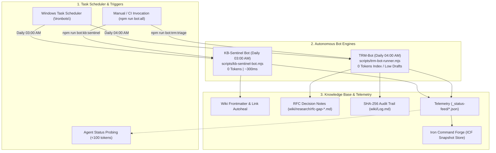

# Ironbots autonomous agent pipeline

Ironbots is the background automated robot subsystem operating within Toolforge and supervised by the Iron Command Forge (ICF) telemetry aggregator.


<details>
<summary>Mermaid source...</summary>



</details>

---

## Architectural integration with ICF

Ironbots operates as a decoupled, zero-token daemon pipeline that emits structured health and progress telemetry ingested by Iron Command Forge:

1. **Telemetry feeds**:
   - `_status-feed/kb_sentinel_report.json`: Knowledge base health score (0–100), broken link counts, frontmatter validation counts, and scan duration.
   - `_status-feed/trm_bot_report.json`: Research gap triage counts, drafted RFC notes, and SQLite topic indexing metrics.
2. **Snapshot store synchronization**:
   - ICF's SQLite snapshot store periodically records health state transitions emitted by Ironbots to track long-term repository documentation stability and topic coverage.
3. **Supervisor integration**:
   - Task Scheduler handles fault isolation and timeout management under the `\Ironbots\` category.
   - ICF dashboards read telemetry directly from the filesystem without spawning long-running browser or LLM sessions.

---

## Bot roster and schedules

| Bot Name | Script Entrypoint | Schedule | Task Category | Primary Artifacts |
|---|---|---|---|---|
| **KB-Sentinel** | `scripts/kb-sentinel-bot.mjs` | Daily 03:00 AM | `\Ironbots\` | `_status-feed/kb_sentinel_report.json` |
| **TRM-Bot** | `scripts/trm-bot-runner.mjs` | Daily 04:00 AM | `\Ironbots\` | `wiki/research/rfc-gap-*.md`, `_status-feed/trm_bot_report.json` |

---

## Operational runbook

### Manual execution
To invoke both bots synchronously from the root repository:
```bash
npm run bot:all
```

### Scheduled task supervision
To inspect the status of the Ironbots tasks in Task Scheduler:
```powershell
pwsh -NoProfile -File scripts/schedule-task-wrapper-KB-Sentinel.ps1 -Action Status
pwsh -NoProfile -File scripts/schedule-task-wrapper-TRM-Bot.ps1 -Action Status
```

To register or update unattended execution (S4U):
```powershell
# Run in Administrator PowerShell
pwsh -NoProfile -File scripts/schedule-task-wrapper-KB-Sentinel.ps1 -Action Register -Unattended -Force
pwsh -NoProfile -File scripts/schedule-task-wrapper-TRM-Bot.ps1 -Action Register -Unattended -Force
```
