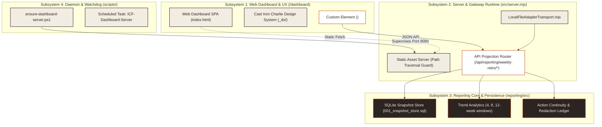

<!--
title: "Architecture Specification"
status: active
owner: chris
last-reviewed: 2026-09-27
brand: hybrid
hybrid-primary: icf
hybrid-secondary: cic
-->

# Architecture Specification

Iron Command Forge (ICF) consolidates workspace operations into four decoupled subsystems:
1. Web dashboard and user experience (`dashboard/`)
2. Server runtime and HTTP gateway (`src/server.mjs`)
3. Reporting core and snapshot store (`reporting/src/`)
4. Daemon supervision and automation (`scripts/`)

---

## Architectural diagram

Mermaid source...

---

## Subsystem specifications

### 1. Web dashboard surface (`/dashboard`)
The web dashboard provides a multi-tab operations center for system ingestion, operational telemetry, and weekly engineering retrospectives.
- **Design system**: Incorporates Cast Iron Charlie (`dashboard/_ds/`) with serif editorial headers (`Playfair Display`), structured tabular sans (`Barlow Condensed`), and monospace badges (`Geist Mono`).
- **Modular components**: Renders `<weekly-reporting-dashboard>` as a custom element connecting directly to the API projection layer.

### 2. Server and gateway runtime (`src/server.mjs`)
The standalone Node.js server exposes HTTP routes on `127.0.0.1:8080`.
- **Security controls**: Verifies incoming URI strings against directory traversal sequences (`/..`, `\..`, `%2e%2e`, and `%2E%2E`) prior to URL normalization, returning HTTP 403 Forbidden on violation.
- **Static routing**: Mounts `dashboard/` assets strictly under the `/dashboard` prefix and returns HTTP 404 for invalid resource paths.
- **API delegation**: Routes `/api/reporting/weekly-retro` queries to `LocalFileAdapterTransport.mjs` or embedded SQLite projections.

### 3. Reporting core and snapshot store (`reporting/src`)
The reporting engine processes weekly telemetry and retrospective data using native `node:sqlite`.
- **Schema versioning**: Applies migrations (`001_snapshot_store.sql` through `005_routing_support.sql`) upon database initialization.
- **Trend evaluation**: Computes rolling metrics across 4, 8, and 12-week intervals, emitting explicit statuses (`EMPTY_WINDOW`, `DATA_PRESENT`, or `TREND_RECALCULATING`).
- **Action tracking**: Manages remediation life cycles, status progressions, and redaction tombstones.

### 4. Background daemon supervision (`scripts/`)
PowerShell automation scripts ensure persistent service availability.
- **Probing and watchdog**: `scripts/ensure-dashboard-server.ps1` checks endpoint responsiveness on port 8080, launching the server process in the background if offline.
- **Task automation**: `scripts/register-dashboard-server-task.ps1` registers the `ICF-Dashboard-Server` task within Windows Task Scheduler.
