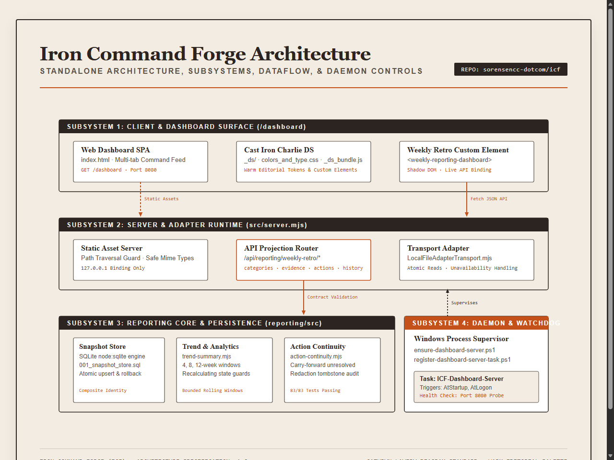
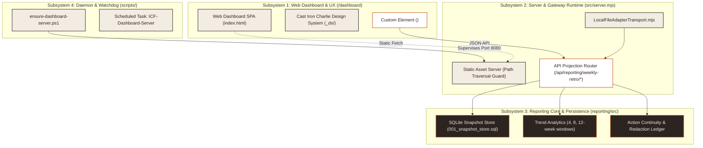

<!--
title: "Iron Command Forge Wiki"
status: active
owner: chris
last-reviewed: 2026-09-27
brand: hybrid
hybrid-primary: icf
hybrid-secondary: cic
-->

# Iron Command Forge Wiki

Iron Command Forge (ICF) is the centralized operations, reporting, telemetry aggregation, and dashboard platform for the developer workspace.

ICF combines an SQLite-backed reporting engine with bounded trend projection, a multi-tab operations dashboard powered by the Cast Iron Charlie design system, an HTTP static and API gateway server, and Windows background daemon supervision.

---

## Core documentation

- [[Architecture]]: System design, subsystem boundaries, and visual architecture specifications.
- [[Reporting-Engine|Reporting Engine]]: SQLite snapshot store schema, rolling trend calculations, action continuity, and redaction ledger.
- [[Web-Dashboard|Web Dashboard]]: Cast Iron Charlie design system, custom HTML web components, and review surfaces.
- [[Operations-Guide|Operations Guide]]: Daemon management, Scheduled Task watchdog installation, and automated health verification.

---

## Architecture overview



<details>
<summary>Mermaid source...</summary>



</details>

---

## Quick start

To start the standalone ICF server, run:
```powershell
npm run start
```

To run all 84 unit and gateway integration tests, run:
```powershell
npm test
```

To verify repository preflight conformance, run:
```powershell
pwsh -NoProfile -File C:\dev\scripts\verify-repo-context.ps1 -Path C:\dev\icf
```
